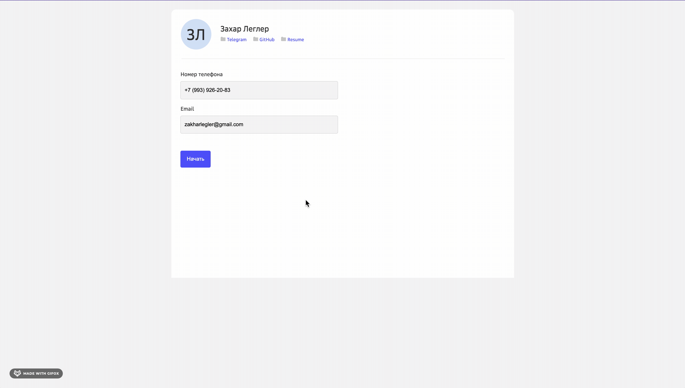

# Forms
SPA-приложение: многостраничная форма с разными полями данных с проработанной валидацией каждого поля. 

### Главная страница
- Информация о пользователе: ссылки для связи
- Форма с полями для телефона и email 

### Страница с основной формой
- Первый шаг: поля nickname, name, surname, sex
- Второй шаг: поля advantages, checkbox-group, radio-group
- Третий шаг: поле about и возможность отправить форму, если все заполнено корректно

## Preview



Технологии, используемые на проекте: <br>

[](https://skillicons.dev)

### Инструкция по запуску приложения
В директории прооекта вы можете запустить:

``` npm install ```

Установка npm:

``` npm run dev ```

Запускает приложение в режиме разработки.
Открыть http://localhost:5173/, чтобы просмотреть в вашем браузере.

## Ссылка на прототип:
https://zlv-forms.netlify.app/)
